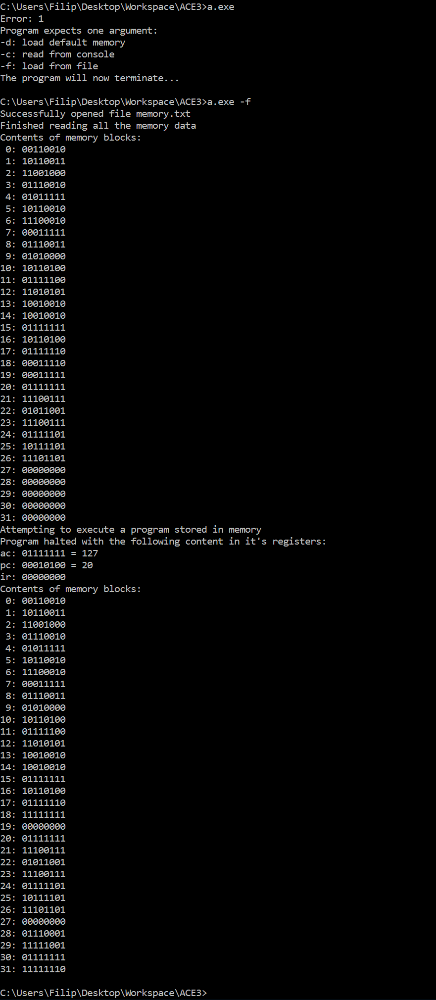

#Disassembler

The assignment was to create a program that would read some machine code and translate it to the Assembly language. It would then execute the given code and show results. It is basically a simplified computer simulator, having only 8-bit long instructions, three registers and 32 bytes of memory. It is a nice example of how a computer actually works.

